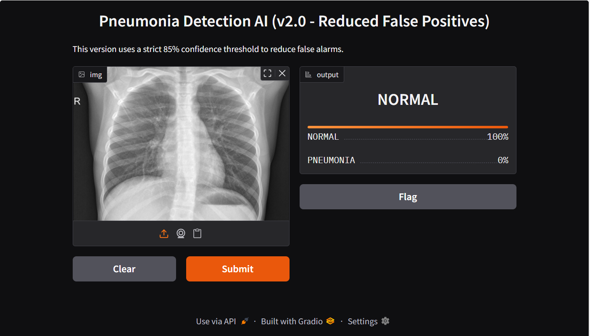

# 🫁 Pneumonia Detection AI

> Deep learning model that detects pneumonia from chest X-rays — built to minimize false negatives, because in medical diagnostics, a miss can be life-altering.


---

## 🎯 The Problem

Standard accuracy metrics lie in medical imaging. A model that's "95% accurate" can still miss 1 in 3 pneumonia cases — and that miss can cost a life. 

This project prioritizes **Recall** over raw accuracy: the model is tuned to be as sensitive as possible to positive (pneumonia) cases, keeping false negatives as low as possible.

---

## 📊 Model Performance

| Metric | Score |
|--------|-------|
| **Recall** | **91%** |
| Architecture | ResNet50 (CNN) |
| Framework | FastAI + PyTorch |
| Task | Binary Classification (Normal / Pneumonia) |

> 91% recall means the model correctly identifies 91 out of every 100 actual pneumonia cases.

---



## 🧠 How It Works

```
Chest X-ray Image
        ↓
Image Preprocessing + Augmentation (FastAI)
        ↓
ResNet50 CNN (Transfer Learning)
        ↓
Binary Classification: NORMAL / PNEUMONIA
        ↓
Prediction + Confidence Score (Gradio UI)
```

Key decisions made during development:
- **Transfer learning** via ResNet50 — pretrained on ImageNet, fine-tuned on X-ray data
- **Class imbalance handling** — dataset skewed toward normal cases, addressed during training
- **Recall optimization** — loss function and threshold tuned to minimize false negatives
- **Grad-CAM ready** — architecture supports visual explanation of model decisions

---

## 🖥️ Run Locally

### 1. Clone the repo
```bash
git clone https://github.com/helloaishav01-tech/pneumonia-detection-ai.git
cd pneumonia-detection-ai
```

### 2. Install dependencies
```bash
pip install -r requirements.txt
```

### 3. Launch the Gradio app
```bash
python app.py
```

Open your browser at `http://localhost:7860` — upload a chest X-ray and get an instant prediction.

---

## 📁 Project Structure

```
pneumonia-detection-ai/
├── app.py                 # Gradio inference UI
├── predict.py             # Prediction logic
├── check_metrics.py       # Model evaluation scripts
├── requirements.txt       # Dependencies
├── train_log.txt          # Training history
└── scripts/               # Helper scripts
```

---

## 🔧 Tech Stack

| Tool | Purpose |
|------|---------|
| Python | Core language |
| FastAI | Model training + image augmentation |
| PyTorch | Deep learning backend |
| ResNet50 | CNN architecture (transfer learning) |
| Gradio | Real-time inference UI |

---

## 💡 What I Learned

- How to handle **class imbalance** in medical datasets
- Why **recall matters more than accuracy** in diagnostic AI
- How to fine-tune **pretrained CNNs** for domain-specific tasks
- Building **production-ready inference interfaces** with Gradio

---

## 👩‍💻 Built By

**Aisha Yasar Gujar** — AI Developer from Mumbai, India

[](https://www.linkedin.com/in/aisha-yasar-dev/)
[](https://github.com/helloaishav01-tech)
[](mailto:helloaisha.v01@gmail.com)

---

*Open to remote roles, freelance, and contracts in AI/ML and Python development.*
